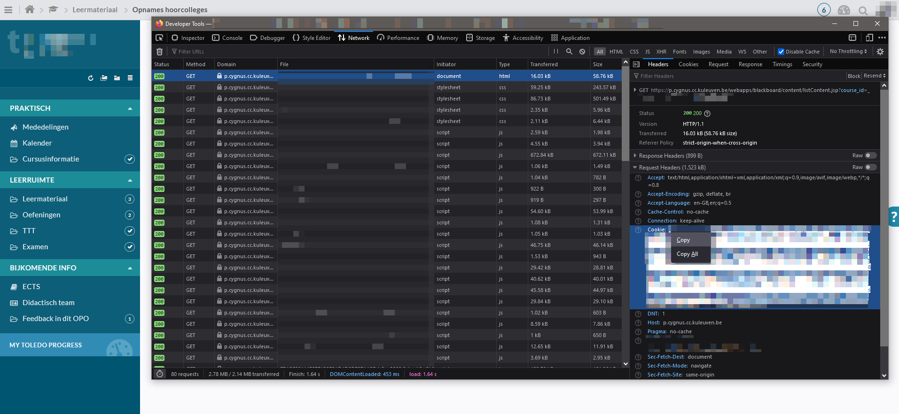

# toledo-dl

**toledo-dl is a Python script for downloading Kaltura videos from Toledo**

It downloads all videos from one or more Toledo pages

## Installation
- Install youtube-dl: https://github.com/ytdl-org/youtube-dl#installation

## Usage 
1. Create an input file, for example `input.txt` and paste the Toledo urls you want to download from, one url per line. The script will download all the videos from a certain url, so paste the url of the overview page. You can reuse this file multiple times.
---
Do every time:

2. Sign in on Toledo with your student account.
3. Open the Web Developer Tools panel with `ctrl+shift+i` or `f12` 
4. Extract the cookie header value from the first request on a toledo course page in your network tab, put the value into `cookies.txt`. *Make sure you're searching under the Request Headers*.

5. Run the toledo-dl script as follows:

```
python3 toledo-dl.py [INPUT_FILE]
or
python3 toledo-dl.py [INPUT_FILE] [Integer]
```
The script will create a new directory per url. This directory will contain the downloaded videos. If you re-run the script, it won't download or speed up the videos again, given that you don't change the name of the files/directories. This means you can re-run this script periodically and only process the new videos on the Toledo page. Do keep in mind you have to download your cookies again every time, because they expire quickly.

### Example
See `example.txt` for an example of the url file.
```
python3 toledo-dl.py example.txt
```
Adding the third argument _Integer_ will only download the last n videos from **all** the videos found from **all** urls. 
```
python3 toledo-dl.py example.txt 5
```
Will then download only the last 5 videos found from all urls.
## Contributing
Pull requests are welcome.

## Disclaimer
This script was made to download Toledo videos for personal use only. Don't redistribute the downloaded videos, as they're still the intellectual property of the lecturer/university.
